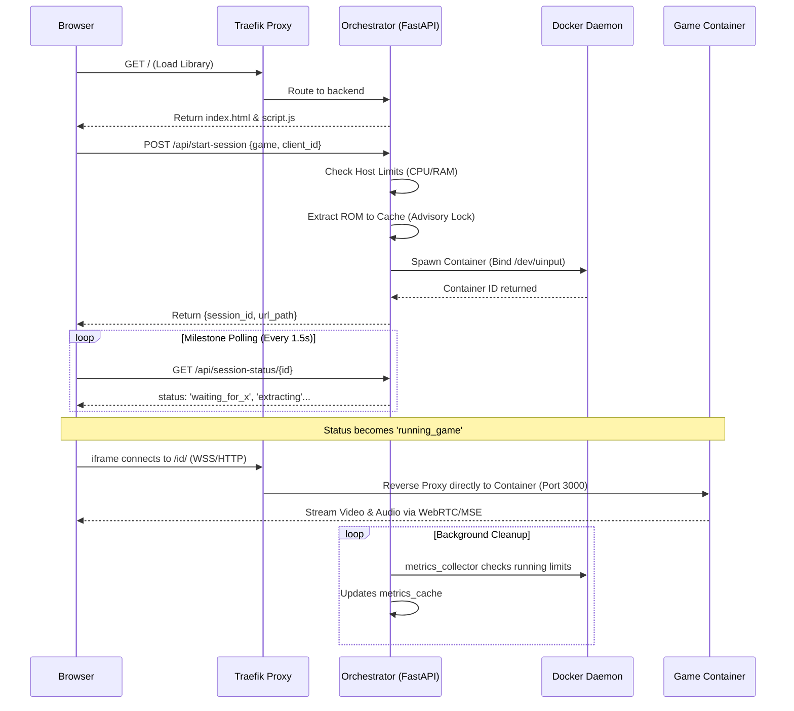

# 🎮 PS1 Engine Technical Documentation

This document provides a comprehensive overview of the PS1 Engine architecture, backend API, and core workflows.

---

## 🏗️ System Architecture

The engine is built on a **fully containerized microservices architecture** managed by Docker Compose.

### 1. Core Services (docker-compose.yml)
- **Traefik Proxy**: The system's edge gateway. It handles both **HTTP (Port 80)** and **HTTPS (Port 443)**.
- **Orchestrator (FastAPI)**: The management layer. It handles API requests, launches session containers, identifies multi-disc sets, and manages the cover art gallery.
- **Watchdog**: A background service that monitors sessions for inactivity and cleans up containers.
- **DuckStation Sessions**: Dynamic, resource-capped containers spawned per game.

## 🛰️ Network & Routing Architecture

The system uses a high-performance "Edge Proxy" design to handle traffic routing, SSL termination, and dynamic service discovery.

### 1. The Edge Proxy: Traefik
Traefik acts as the **Maitre D'** for the entire platform. It is the only service exposed to the host's ports 80 (HTTP) and 443 (HTTPS).
- **SSL Termination**: Traefik handles all HTTPS encryption, satisfying the "Secure Context" requirement for the `WebCodecs API`.
- **Dynamic Discovery**: It monitors the Docker socket. When the Orchestrator starts a new game container, Traefik detects the new labels and updates its routing table in milliseconds without a restart.
- **Path-Based Multiplexing**: 
    - Requests for `/` or `/api/*` are routed to the **Orchestrator**.
    - Requests for `/{session_id}/*` are routed directly to the specific **Game Session** container.

### 2. The Internal Flow
| Layer | Responsibility | Components Served |
| :--- | :--- | :--- |
| **Edge** | SSL, Auth, Routing | **Traefik** |
| **Logic** | API & Static Files | **FastAPI** (Orchestrator) |
| **Stream** | Video/Audio/Input | **KasmVNC** (Session Containers) |

### 3. Serving Frontend vs. Backend
- **Frontend (SPA)**: The HTML, CSS, and JS files (located in `/static`) are served by the **FastAPI** instance inside the Orchestrator via `app.mount`. Traefik acts as the relay from the client back to the Orchestrator.
- **Direct Streaming**: For performance, the heavy video/audio stream data (KasmVNC on port 3000) **bypasses the Orchestrator code entirely**. Traefik routes this traffic directly from the browser to the session container, ensuring the main API stays responsive even under high load.

### 4. Routing Priorities (The Hierarchy)
To prevent conflicts between the various services sharing the same domain, Traefik uses a strict priority ladder. Higher numbers take precedence:

| Priority | Router Name | Protected by Auth? | Description |
| :--- | :--- | :--- | :--- |
| **100** | `duckstation-{id}` | Session Password | Game video stream. Highest priority to override any overlapping paths. |
| **40** | `orchestrator-admin` | **YES** | Management APIs (`/api/admin/`) and Dashboard (`/admin`). |
| **30** | `orchestrator-api` | No | Public Orchestrator APIs (ROM list, starting sessions, art, etc.). |
| **20** | `traefik-dashboard` | **YES** | Internal Traefik system monitoring (`/dashboard/`). |
| **1** | `orchestrator-secure`| No | The Default Catch-all. Serves the main UI library. |

---

---

## 📡 Backend API Reference

The Orchestrator provides several endpoints for management and state tracking.

### 1. Game Management
- **`GET /api/roms`**
  - Returns a de-duplicated list of games. Multi-disc sets (Disc 1, 2...) are merged into a single entry with a calculated `game_id` for artwork matching.
- **`GET /api/rom-art/{game_id}`** (Cached 30 Days)
  - Serves game posters. Automatically fetches missing art from Libretro Thumbnails.
- **`POST /api/start-session`**
  - **Payload**: `{"game_filename": "Road Rash.zip", "client_id": "unique-id"}`
  - **Logic**: 
    - Checks if the user already has a session running.
    - If same user/same game: Returns existing session credentials.
    - If same user/new game: Recycles (replaces) the existing container.
    - If new: Spawns a fresh DuckStation container.
  - **Returns**: `session_id`, `url_path`, `username`, `password`.

### 1. Real-time Status Monitoring (Background Buffering)
The Orchestrator provides a granular `/api/session-status/` endpoint used by the frontend to confirm readiness.
- **Background Collector**: A high-performance background task polls all running containers every 3 seconds.
- **Privacy Enforcement**: The `/api/session-status/{session_id}` endpoint now requires a `client_id` parameter. The Orchestrator verifies that the requestor owns the session before returning metrics.
- **Zero-Wait Response**: The API returns from this in-memory cache instantly without blocking.
- **Heartbeat & Reaping**: The frontend monitors the heartbeat. If a container stops or an admin kills it, the frontend automatically transitions the user from "Theater Mode" back to the library.
- **Health Indicators**:
  - `process_alive`: Checks via `pgrep` if DuckStation is running.
  - `window_mapped`: Uses `xwininfo` to confirm the game window is actually visible in the X server.
  - `status_marker`: Parses internal `/config/autostart.log` for lifecycle events (`RUNNING_GAME`, `ERROR`, `STOPPED`).
  - **Statuses**: `initializing`, `running_game`, `stuck`, `stopped`, `error`.

---

## 🎨 Frontend & Full Lifecycle Workflow

The system uses an asynchronous, non-blocking flow to provision resources.

### 1. End-To-End Sequence Diagram


### 2. Frontend Step-By-Step
The frontend is a lightweight, responsive SPA (Single Page Application) located in the `/static` directory.
1.  **Identification**: Generates a persistent `clientId` (UUID) in `localStorage` for secure session ownership.
2.  **Library Loading**: Renders a premium **Poster Gallery**.
3.  **Launching**:
    - User clicks a card -> `POST /api/start-session`.
    - Shows a loading overlay while the container boots and Traefik registers the route.
4.  **Redirection**: Once the API returns success, the frontend redirects the game `iframe` to the `url_path`.
5.  **Interaction**: The video starts streaming automatically directly from the container via HTTP over Port 3000.

---

## 🔍 Extensive Code Walkthrough

This section provides an in-depth look at specifically *how* the moving parts of the PS1 Engine function using actual code references.

### 1. Host Protection & Rate Limiting (`main.py`)
Before the Orchestrator even turns on the Docker engine, it protects itself from being overwhelmed by users.

```python
# From main.py -> start_session()
ok, reason = check_host_resources()
if not ok:
    raise HTTPException(status_code=503, detail=f"Server at capacity: {reason}")

if is_rate_limited(request.client_id):
    raise HTTPException(status_code=429, detail="Too many launch requests. Wait a moment.")
```
**How it works**: The `check_host_resources()` function reads `psutil.cpu_percent()` and `psutil.virtual_memory()`. If the total server memory or CPU utilization crests above `MAX_HOST_MEM_PERCENT` (default 90%), it denies the launch entirely.

### 2. The Universal Heartbeat (`main.py`)
Instead of allowing 40 users to concurrently spam the Docker API to ask "is my game ready?", the Orchestrator uses a centralized buffered collector:

```python
# From main.py -> metrics_collector()
async def metrics_collector():
    while True:
        try:
            containers = client.containers.list(filters={"name": "duckstation-"})
            updates = await asyncio.gather(*[
                loop.run_in_executor(executor, _collect_container_metrics, c) 
                for c in containers
            ])
            # ... update metrics_cache Dictionary
        except Exception as e:
            pass
        await asyncio.sleep(4)
```
**How it works**: Every 4 seconds, this background thread parallelizes the collection of memory, cpu, and file states (`/tmp/session_status`) for *every* running container into a single `metrics_cache` Dictionary.

### 3. Container Initialization Safety (`custom_autostart.sh`)
Inside the container, there is a race condition: the desktop environment must be completely booted *before* DuckStation tries to draw to the screen.

```bash
# Wait for X server to be ready
echo "Waiting for X server..." > /config/autostart.log
for i in $(seq 1 30); do
    echo "WAITING_FOR_X" > /tmp/session_status
    if xdpyinfo -display :1 >/dev/null 2>&1; then
        echo "X server ready after ${i}s" >> /config/autostart.log
        echo "INITIALIZING" > /tmp/session_status
        break
    fi
    sleep 1
done
```
**How it works**: The bash script continuously probes `xdpyinfo`. It signals its current state to `/tmp/session_status` which the Orchestrator's `metrics_collector` (mentioned above) reads. The frontend translates `WAITING_FOR_X` into the "Setting up graphics engine..." user milestone.

### 4. Seamless Frontend Reconnections (`script.js`)
If a user puts the page in the background or an admin kills the container, the Javascript flawlessly updates without page reloads.

```javascript
// From script.js -> enterTheater()
monitorInterval = setInterval(async () => {
    // Skip if tab hidden to save server resources
    if (document.visibilityState === 'hidden') return;

    try {
        const res = await fetch(`/api/session-status/${sessionId}?client_id=${clientId}`);
        const data = await res.json();

        if (['stopped', 'not_found', 'error'].includes(data.status)) {
            exitTheater(); // Container was killed, close iframe
        }
    } catch (e) { }
}, 4000); 
```
**How it works**: The frontend polls the in-memory cache we built in `main.py`. If you hide the tab, `visibilityState === 'hidden'` completely pauses the network requests. The moment you look at the tab again, it resumes. If it sees `not_found`, it knows the Watchdog or Admin deleted the container and ejects you safely.

---


## ⚙️ Configuration Management

The system uses a two-tier configuration strategy to balance host security with container flexibility.

### 1. `.env` (Source of Truth)
Located on the host machine only. These values are **never** mounted inside game containers.
- `DOMAIN_LOCAL` / `DOMAIN_REMOTE`: The network entry points.
- `ROM_DIR` / `BIOS_DIR`: Absolute host paths to media.
- `ROM_CACHE_DIR`: Project-local path for persistence.

### 2. `config.env` (Shared Engine Settings)
Global settings applied to the orchestrator. For security, these are **no longer mounted** into game containers.
- **Safety Caps**: `MAX_HOST_CPU_PERCENT`, `MAX_HOST_MEM_PERCENT`, `RATE_LIMIT_SESSIONS_PER_MIN`.
- **Performance**: `CPUS_PER_SESSION`, `MEM_LIMIT_PER_SESSION`.
- **Profiles**: `RESOLUTION_SCALE`.

---

## 🏎️ Scaling & Resource Limits

To support up to **40+ simultaneous players** on a 50-core system, the engine enforces strict resource boundaries:

1.  **CPU Capping**: Each session is limited via `nano_cpus` (controlled by `CPUS_PER_SESSION`).
2.  **RAM Limits**: Containers are hard-capped (default `2g` via `MEM_LIMIT_PER_SESSION`) to prevent OOM (Out Of Memory) crashes on the host.
3.  **Safety Valve (Host Monitor)**: The Orchestrator polls host CPU/RAM before every launch. If host usage > 90%, it blocks new sessions with a `503 Service Unavailable` message.
4.  **Protection (Rate Limiter)**: Prevents launch-button spam by restricting users to 3 requests per minute.
5.  **Resolution Optimization**: At `RESOLUTION_SCALE=1`, the emulator uses native software rendering.
3.  **Network Efficiency**: Selkies uses Websockets with tuned bitrates (default 2mbps) to minimize bandwidth congestion during high-concurrency usage.

---

## 🌐 Multi-Domain Connectivity

The system is designed for hybrid access (Local + Remote):
- **Dynamic Entry**: Traefik is configured to dynamically accept requests from the domains defined in your `.env` file (`DOMAIN_LOCAL` and `DOMAIN_REMOTE`).
- **Domain Agnostic Routing**: Game sessions use relative path redirects. This allows a user to start a game on one domain and stay on that same domain throughout the session without CORS or certificate errors.

---

## 🛡️ Admin Dashboard & Security

The system includes a protected Admin Dashboard at `/admin.html` for global monitoring.

### 1. Authentication Strategy
Access is protected by **Traefik Basic Auth Middleware**. 
- **File**: `.credentials` (Hashed username/password).
- **Enforcement**: Traefik intercepts requests at the network level before they reach the application.

### 2. Password Hashing (SHA-1)
We use the `{SHA}` hashing format for compatibility. You can generate a new password entry using the following command:

```bash
# Generate a new admin credential (e.g., username: admin, password: NEW_PASSWORD)
python3 -c "import hashlib, base64; print('admin:{SHA}' + base64.b64encode(hashlib.sha1('NEW_PASSWORD'.encode()).digest()).decode())" > .credentials
```

### 3. Rotating Credentials
To change the admin password:
1. Run the command above with your new password.
2. Restart the orchestrator and traefik: `docker-compose up -d --force-recreate traefik orchestrator`.

### 4. Capabilities
- **Live Metrics**: Real-time CPU and Memory stats via Docker API.
- **Global Termination**: Ability to force-stop any running container regardless of its owner.

---

## 🛠️ Engine Workarounds & Stability Features

To ensure a seamless experience for 40+ concurrent users, the engine implements several non-standard workarounds to resolve upstream limitations and race conditions.

### 1. PTY-Based Emulator Launch (Headless Evasion)
DuckStation behaves differently when run in a non-interactive (headless) environment. We replace the standard shell launcher with a Python script (`launch_duck.py`) that uses the `pty` module to allocate a pseudo-terminal. This tricks the emulator into running as if it's in an interactive terminal, preventing it from ignoring arguments or hanging at the BIOS screen.

### 2. Persistent ROM Cache System
To eliminate the 10-20 second ZIP extraction delay on every launch:
- **Flow**: Extraction happens **once** on the host. All subsequent sessions mount the pre-extracted files instantly.
- **Self-Healing**: On every launch, it verifies the file count and size against the original ZIP. If corrupted, it deletes and re-extracts.
- **Disk Safety**: Enforces a host-wide `ROM_CACHE_MAX_MB` limit (default 5GB).

### 3. Update Check "Blackholing"
Upstream DuckStation attempts to check for updates on every launch. In a containerized environment, this can cause the emulator to hang for up to 30 seconds.
- **Solution**: The Orchestrator injects `extra_hosts` into every session container, mapping `api.github.com` and `github.com` to `0.0.0.0`. This effectively "blackholes" the update check instantly.

### 2. glibc DNS Lookup Crash (IPv6)
A known bug in `glibc` causes DNS lookups to crash in certain Docker environments when IPv6 is enabled but unconfigured.
- **Solution**: All session containers are launched with the kernel-level flag `net.ipv6.conf.all.disable_ipv6: 1`.

### 3. Concurrent Extraction Locking (Advisory Locks)
If multiple users start the same game simultaneously, they could both attempt to extract the ZIP ROM to the cache at once, resulting in corrupted files.
- **Solution**: The Orchestrator uses **Linux Advisory File Locking** (`fcntl`).
    - A `.lock` file is created for the specific ROM.
    - Subsequent users are blocked from extraction until the first user completes the process and releases the lock.
    - Locks are automatically released by the kernel if the process crashes.

### 4. Watchdog Grace Period
To prevent the Watchdog service from killing a session before the user has even finished loading the page.
- **Solution**: A **120-second Grace Period** is enforced. The Watchdog ignores any container with an uptime of less than 2 minutes.

### 5. Frontend UI Debouncing
Prevents "Double-Click" errors where a user might accidentally spawn multiple containers for one session.
- **Solution**: The JavaScript frontend implements an `isLaunching` flag and disables all library pointer events (`grid.style.pointerEvents = 'none'`) the moment a game is clicked.

### 6. Container Recycling Loops
Docker's container removal can be asynchronous, sometimes leading to "container name already in use" errors if a user switches games quickly.
- **Solution**: The Orchestrator implements a **verification loop** that waits up to 5 seconds for the previous container to be fully removed from the Docker engine.

### 7. Multi-Disc Set Detection
- **Problem**: Multi-disc games (e.g. Final Fantasy VII) cluttering the library.
- **Solution**: The backend automatically groups files with "(Disc X)" indicators. When a game is launched, it generates a virtual `playlist.m3u` on-the-fly, allowing users to swap discs via the emulator menu without restarting the container.

### 8. Smart Art Fetcher & Cache
- **Problem**: Finding high-quality box art for dynamic libraries.
- **Solution**: The `/api/rom-art` endpoint implements a proxy-fetcher. It converts game names into Libretro-compatible slugs, downloads official box art from GitHub thumbnails, and stores them in a persistent `userdata/covers` volume. Client browsers are instructed to cache these images for 30 days.

### 9. Host Metadata Striping
- **Problem**: Mounting host files reveals directory structures and usernames inside containers.
- **Solution**: Switched all Docker volumes to **Relative Paths** (`./`) and removed critical file mounts (like `config.env`).
- **Result**: `main.py` contains zero host-specific paths. All sensitive data is isolated to the `.env` file.

### 10. Multi-Domain Routing
- **Problem**: Hardcoded hostnames in Traefik rules preventing local/remote switching.
- **Solution**: Routing rules now use `${DOMAIN_LOCAL}` and `${DOMAIN_REMOTE}` variables from the environment.

---

## 🚀 Performance Optimizations

### 1. In-Memory Metrics Buffering
The Orchestrator uses a global dictionary to buffer stats. This prevents the "landmine" where multiple frontend polls would cause the backend to block on synchronous resource checks (like `docker stats`).

### 2. Frontend Tab-Awareness
The JavaScript frontend detects `visibilityState`. If a user switches tabs during the "Booting" phase, polling is automatically paused to conserve client and server resources.

### 3. Theater Mode UI
The system avoids external redirects. Using an overlay `<iframe>`, the parent page remains active and maintains the heartbeat monitoring loop. This allows for a seamless "exit and return" experience without browser navigation delays.
