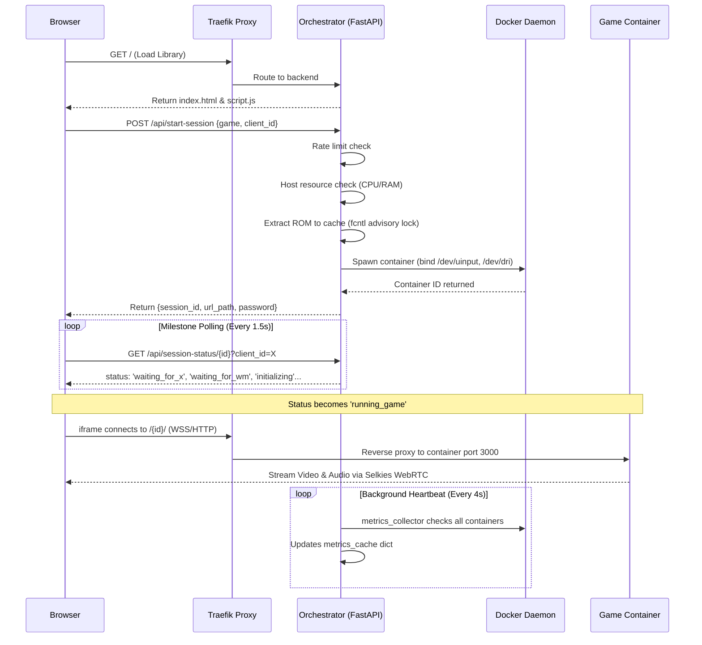

# 🎮 PS1 Engine Technical Documentation

This document provides a comprehensive overview of the PS1 Engine architecture, backend API, and core workflows.

---

## 🏗️ System Architecture

The engine is built on a **fully containerized microservices architecture** managed by Docker Compose.

### Core Services (`docker-compose.yml`)
| Service | Container | Image | Role |
|---|---|---|---|
| **Traefik Proxy** | `traefik` | `traefik:v3.0` | Edge gateway — HTTP (80), HTTPS (443), SSL termination, dynamic routing |
| **Orchestrator** | `ps1-orchestrator` | Built from `Dockerfile.orchestrator` | FastAPI API server — session management, ROM cache, cover art |
| **Watchdog** | `ps1-watchdog` | Built from `Dockerfile.orchestrator` | Background reaper — kills idle sessions after `IDLE_TIMEOUT_MINS` |
| **DuckStation Sessions** | `duckstation-{id}` | `custom-duckstation` (built from `Dockerfile.duckstation`) | Per-user emulator containers, resource-capped |

---

## ⚙️ Configuration Management

The system uses a **two-file configuration strategy** to separate host-level Docker settings from runtime engine tuning.

> [!IMPORTANT]
> **`.env`** and **`config.env`** serve different purposes. Do not conflate them.

### 1. `.env` — Host-Level Docker Compose Variables
These are consumed by `docker-compose.yml` for bind mounts, Traefik routing rules, and container environment injection. They are **never** loaded directly by `main.py` — they arrive via Docker's `env_file:` directive or `environment:` block.

| Variable | Default | Description | Consumed By |
|---|---|---|---|
| `DOMAIN_LOCAL` | `ps1.lan` | LAN domain for Traefik routing rules | `docker-compose.yml` Traefik labels |
| `DOMAIN_REMOTE` | `ps1.yourdomain.com` | WAN domain for Traefik routing rules; also read by `main.py` as `DOMAIN` | `docker-compose.yml` Traefik labels, `main.py` L214 |
| `HOST_ROM_DIR` | `/path/to/ROMs/PSX` | Absolute host path to PS1 ROMs | `docker-compose.yml` bind mount, `main.py` L224 |
| `HOST_SNES_ROM_DIR` | `./userdata/snes` | Host path to SNES ROMs | `docker-compose.yml` bind mount |
| `HOST_GBA_ROM_DIR` | `./userdata/gba` | Host path to GBA ROMs | `docker-compose.yml` bind mount |
| `HOST_BIOS_DIR` | `/path/to/ROMs/BIOS` | Host path to PS1 BIOS files | `docker-compose.yml` bind mount, `main.py` L225 |
| `HOST_CACHE_DIR` | `/tmp/ps1cache` | Host path for extracted ROM cache | `docker-compose.yml` bind mount, `main.py` L226 |

### 2. `config.env` — Runtime Engine Settings
Loaded by the Orchestrator (`main.py` L29-30) and Watchdog (`watchdog.py` L8) via `python-dotenv`. Changes require a service restart (`./start.sh`).

| Variable | Default | Description | Consumed By |
|---|---|---|---|
| `RESOLUTION_SCALE` | `1` | Rendering profile: 1=Software (efficient), 2=Vulkan Mid, 3+=Vulkan High | `main.py` L456 → injected into container env |
| `CPUS_PER_SESSION` | `2.0` | CPU cores per session (Docker `nano_cpus`) | `main.py` L215, L557 |
| `MEM_LIMIT_PER_SESSION` | `2g` | RAM limit per container | `main.py` L218, L558 |
| `AUDIO_BACKEND` | `Cubeb` | Audio backend: Cubeb, PulseAudio, ALSA, Null | `main.py` L468 → injected into container env |
| `STREAM_BITRATE` | `2000` | Video bitrate in kbps. Injected as `SELKIES_VIDEO_BITRATE` — sets the initial bitrate directly on the selkies-gstreamer process. LSIO also offers `SELKIES_H264_CRF` for web UI quality control; both coexist. | `main.py` L470 → injected into container env |
| `STREAM_FRAMERATE` | `30` | Max FPS. Injected as `SELKIES_VIDEO_FRAMERATE` — sets the initial framerate on the selkies-gstreamer process. LSIO also offers `SELKIES_FRAMERATE` for web UI slider; both coexist. | `main.py` L470 → injected into container env |
| `STREAM_QUALITY` | `50` | Encoder quality (1-100). Mapped to `SELKIES_H264_CRF` (CRF 50-5, lower=better). | `main.py` L458 → injected into container env |
| `SHOW_FPS` | `false` | Show FPS counters in emulator. Injected into container; consumed by `custom_autostart.sh` `[Display] ShowFPS`. | `main.py` L474 → injected into container env |
| `ENABLE_DEBUG_MODE` | `false` | When `true`, shows DEBUG_MODE_FULL_ACCESS card; mounts full `/roms` | `main.py` L31, L206, L482-484, L808 |
| `ROM_CACHE_MAX_MB` | `5000` | Max disk space for extracted ROM cache in MB (0=disabled) | `main.py` L216, L345 |
| `MAX_HOST_CPU_PERCENT` | `90` | Host CPU load (%) threshold before blocking new sessions | `main.py` L219, L251 |
| `MAX_HOST_MEM_PERCENT` | `90` | Host RAM usage (%) threshold before blocking new sessions | `main.py` L220, L262 |
| `RATE_LIMIT_SESSIONS_PER_MIN` | `3` | Max session launch requests per client per minute | `main.py` L221, L239 |
| `IDLE_TIMEOUT_MINS` | `30` | Minutes of inactivity before watchdog kills a session | `watchdog.py` L66 |
| `NETWORK_NAME` | `emulator-net` | Docker network name for spawned containers | `main.py` L211, L555 |
| `IMAGE_NAME` | `custom-duckstation` | Docker image for session containers | `main.py` L212, L554 |
| `COVERS_DIR` | `/app/userdata/covers` | Path to cached cover art images | `main.py` L217, L686 |

> [!NOTE]
> `watchdog.py` **hardcodes** `emulator-net` and `custom-duckstation` in its container filter (L35) rather than reading `NETWORK_NAME`/`IMAGE_NAME` from config. Only `IDLE_TIMEOUT_MINS` is dynamically loaded.

---

## 🛰️ Network & Routing Architecture

### 1. The Edge Proxy: Traefik
Traefik is the **only service exposed** to host ports 80 (HTTP) and 443 (HTTPS).
- **SSL Termination**: Handles all HTTPS via certs in `traefik_dynamic.yml`.
- **Dynamic Discovery**: Monitors Docker socket for new container labels.
- **Path-Based Multiplexing**:
  - `/` or `/api/*` → **Orchestrator**
  - `/{session_id}/*` → **Game Session** container
  - `/dashboard/` → **Traefik Dashboard** (admin-auth protected)
  - `/admin` or `/api/admin/*` → **Admin API** (admin-auth protected)

### 2. Routing Priority Hierarchy
| Priority | Router | Auth? | Description |
|:---|:---|:---|:---|
| **100** | `duckstation-{id}` | Session Password | Game stream. Injected dynamically via Docker labels at container creation. |
| **40** | `orchestrator-admin` | **YES** (Basic Auth) | Admin APIs (`/api/admin/`) and Dashboard (`/admin`). |
| **30** | `orchestrator-api` | No | Public APIs: ROM list, start/stop session, art, status. |
| **20** | `traefik-dashboard` | **YES** (Basic Auth) | Traefik internal dashboard at `/dashboard/`. |
| **1** | `orchestrator-secure` | No | Catch-all — serves the SPA frontend. |

### 3. URL Reference
All public URLs use the domains defined in `.env`:

| Endpoint | URL |
|---|---|
| **Frontend (SPA)** | `https://${DOMAIN_REMOTE}/` |
| **Public API** | `https://${DOMAIN_REMOTE}/api/roms`, `/api/start-session`, etc. |
| **Admin Dashboard** | `https://${DOMAIN_REMOTE}/admin` |
| **Admin API** | `https://${DOMAIN_REMOTE}/api/admin/sessions` |
| **Traefik Dashboard** | `https://${DOMAIN_REMOTE}/dashboard/` (Basic Auth) |
| **Game Session** | `https://${DOMAIN_REMOTE}/{session_id}/` |

> [!WARNING]
> Port 8080 is **not exposed** in `docker-compose.yml`. The Traefik dashboard is accessed through the main HTTPS port (443) at `/dashboard/`, protected by admin-auth middleware.

---

## 📡 Backend API Reference

### Game Management
| Method | Endpoint | Auth | Description |
|---|---|---|---|
| `GET` | `/api/roms` | No | De-duplicated game list. Multi-disc sets merged. Returns `{ps1: [], snes: [], gba: []}`. |
| `GET` | `/api/rom-art/{game_id}` | No | Serves game poster. Auto-fetches from Libretro Thumbnails if missing. Cached 30 days. |
| `POST` | `/api/start-session` | No | Payload: `{"game_filename": "Game.zip", "client_id": "uuid", "platform": "ps1"}`. Spawns or reuses container. |
| `GET` | `/api/session-status/{session_id}?client_id=X` | Owner only | Returns metrics from in-memory cache. Verifies ownership. |
| `GET` | `/api/active-sessions/{client_id}` | No | Lists all sessions owned by a client. |
| `POST` | `/api/stop-session/{session_id}` | Owner only | Payload: `{"client_id": "uuid"}`. Force-removes the container. |

### Admin API (Basic Auth via Traefik)
| Method | Endpoint | Description |
|---|---|---|
| `GET` | `/api/admin/sessions` | Lists all running sessions with CPU/RAM metrics and host stats. |
| `POST` | `/api/admin/stop-session/{session_id}` | Force-stops any session regardless of owner. |
| `GET` | `/admin` | Serves the admin dashboard HTML page. |

### WASM Platforms (SNES, GBA)
When `platform` is not `ps1`, the Orchestrator returns a static URL to the browser-based emulator instead of spawning a Docker container:
```
/emulator.html?core={platform}&rom=/rom-files/{platform}/{encoded_rom}
```

---

## 🎨 Frontend & Full Lifecycle Workflow

### End-To-End Sequence Diagram


### Frontend Step-By-Step
1. **Identification**: Generates a persistent `clientId` (UUID) in `localStorage`.
2. **Library Loading**: Renders a poster gallery with cover art from `/api/rom-art/`.
3. **Launching**: User clicks a card → `POST /api/start-session` → loading overlay shown.
4. **Polling**: Frontend polls `/api/session-status/` for milestone updates (WAITING_FOR_X → WAITING_FOR_WM → INITIALIZING → RUNNING_GAME).
5. **Theater Mode**: Once `running_game`, an `<iframe>` loads `/{session_id}/` for the Selkies stream.
6. **Heartbeat**: Background interval checks session status; auto-exits if container dies.

---

## 🔒 Container Security Hardening

Every game session container is launched with these security environment variables (set in `main.py` L473-478):

| Variable | Value | Purpose |
|---|---|---|
| `HARDEN_DESKTOP` | `true` | Locks down the desktop environment |
| `DISABLE_OPEN_TOOLS` | `true` | Prevents opening system tools |
| `DISABLE_SUDO` | `true` | Removes sudo access |
| `DISABLE_TERMINALS` | `true` | Blocks terminal access |
| `DISABLE_CLOSE_BUTTON` | `true` | Prevents closing the emulator window |
| `DISABLE_MOUSE_BUTTONS` | `true` | Disables right-click context menus |
| `HARDEN_KEYBINDS` | `true` | Prevents system keybind escapes |
| `SELKIES_COMMAND_ENABLED` | `False` | Disables Selkies command execution |
| `SELKIES_UI_SIDEBAR_SHOW_FILES` | `False` | Hides file browser in Selkies UI |
| `SELKIES_UI_SIDEBAR_SHOW_APPS` | `False` | Hides app launcher in Selkies UI |
| `SELKIES_FILE_TRANSFERS` | `""` | Disables file transfer capability |

Additionally, DNS "blackholing" is applied via `extra_hosts`:
- `api.github.com` → `0.0.0.0`
- `github.com` → `0.0.0.0`

This prevents DuckStation from hanging on update checks.

---

## 📡 Selkies Streaming Variables (LSIO Base Image)

The DuckStation container is based on [docker-baseimage-selkies](https://github.com/linuxserver/docker-baseimage-selkies). Below are the **streaming-related** Selkies env vars available for injection. Variables marked ✅ are currently set by `main.py`; ⬜ are available but unused.

### Video & Encoding
| Variable | Default | Type | Status | Description |
|---|---|---|---|---|
| `SELKIES_ENCODER` | `x264enc,x264enc-striped,jpeg` | Enum | ⬜ | Comma-separated encoder list. First = default. |
| `SELKIES_FRAMERATE` | `8-120` | Range | ⬜ | FPS range or fixed value. **This is the correct framerate var for LSIO.** |
| `SELKIES_H264_CRF` | `5-50` | Range | ⬜ | H.264 Constant Rate Factor (lower = higher quality/bitrate). **This is the correct quality control for LSIO.** |
| `SELKIES_JPEG_QUALITY` | `1-100` | Range | ⬜ | JPEG encoder quality (when using `jpeg` encoder). |
| `SELKIES_H264_FULLCOLOR` | `False` | Bool | ⬜ | Full color range for H.264. |
| `SELKIES_H264_STREAMING_MODE` | `False` | Bool | ⬜ | Streaming optimization mode. |
| `SELKIES_USE_CPU` | `False` | Bool | ⬜ | Force CPU encoding. |
| `SELKIES_USE_PAINT_OVER_QUALITY` | `True` | Bool | ⬜ | Use paint-over quality optimization. |
| `SELKIES_MANUAL_WIDTH` | `0` | Int | ✅ | Lock resolution width. |
| `SELKIES_MANUAL_HEIGHT` | `0` | Int | ✅ | Lock resolution height. |
| `SELKIES_VIDEO_BITRATE` | — | Int | ✅ | Upstream selkies-gstreamer var. Sets initial bitrate directly on the process. Works alongside LSIO's `SELKIES_H264_CRF`. |
| `SELKIES_VIDEO_FRAMERATE` | — | Int | ✅ | Upstream selkies-gstreamer var. Sets initial framerate directly on the process. Works alongside LSIO's `SELKIES_FRAMERATE`. |

### Audio
| Variable | Default | Status | Description |
|---|---|---|---|
| `SELKIES_AUDIO_ENABLED` | `True` | ⬜ | Enable/disable audio streaming. |
| `SELKIES_AUDIO_BITRATE` | `320000` | ✅ | Audio bitrate in bps. |
| `SELKIES_MICROPHONE_ENABLED` | `True` | ⬜ | Enable microphone passthrough. |

### UI Controls
| Variable | Default | Status | Description |
|---|---|---|---|
| `SELKIES_UI_SHOW_SIDEBAR` | `True` | ⬜ | Show/hide the settings sidebar. |
| `SELKIES_UI_SIDEBAR_SHOW_VIDEO_SETTINGS` | `True` | ⬜ | Show video settings in sidebar. |
| `SELKIES_UI_SIDEBAR_SHOW_AUDIO_SETTINGS` | `True` | ⬜ | Show audio settings in sidebar. |
| `SELKIES_UI_SIDEBAR_SHOW_STATS` | `True` | ⬜ | Show stream stats in sidebar. |
| `SELKIES_UI_SIDEBAR_SHOW_GAMEPADS` | `True` | ⬜ | Show gamepad config in sidebar. |
| `SELKIES_UI_SIDEBAR_SHOW_FILES` | `True` | ✅ (`False`) | File browser (disabled for security). |
| `SELKIES_UI_SIDEBAR_SHOW_APPS` | `True` | ✅ (`False`) | App launcher (disabled for security). |
| `SELKIES_COMMAND_ENABLED` | `True` | ✅ (`False`) | Remote command execution (disabled). |
| `SELKIES_FILE_TRANSFERS` | `upload,download` | ✅ (`""`) | File transfer (disabled). |
| `SELKIES_GAMEPAD_ENABLED` | `True` | ⬜ | Gamepad input passthrough. |
| `SELKIES_CLIPBOARD_ENABLED` | `True` | ⬜ | Clipboard passthrough. |

> **ℹ️ Note**: `main.py` injects `SELKIES_VIDEO_BITRATE` and `SELKIES_VIDEO_FRAMERATE` (upstream selkies-gstreamer vars) which set the **initial stream defaults** directly on the gstreamer process. LSIO also offers `SELKIES_H264_CRF` and `SELKIES_FRAMERATE` which control the **web UI sliders**. Both mechanisms coexist — the upstream vars work, while the LSIO vars could optionally be added to let users adjust quality via the Selkies sidebar.

---

## 🔍 Container Bootstrap: `custom_autostart.sh`

Inside each DuckStation container, the `custom_autostart.sh` script orchestrates the startup sequence:

1. **X Server Wait** — Polls `xdpyinfo` up to 30s, writing `WAITING_FOR_X` to `/tmp/session_status`.
2. **Window Manager Wait** — Polls for `openbox` process up to 15s, writing `WAITING_FOR_WM`.
3. **DuckStation Config** — Generates `settings.ini` from Docker env vars (`RENDERER`, `RESOLUTION_SCALE`, `TEXTURE_FILTERING`, `VSYNC`, `AUDIO_BACKEND`, etc.).
4. **ROM Handling** — If `ROM_PRECACHED=true`, mounts the pre-extracted directory. Otherwise, unzips the mounted `.zip` in-container.
5. **PTY Launch** — Uses a Python script with `pty.openpty()` to trick DuckStation into thinking it's in an interactive terminal, preventing headless hangs.
6. **Lifecycle** — When DuckStation exits, `sudo kill 1` terminates the container's init process, causing auto-cleanup.

Status markers written to `/tmp/session_status`:
`INITIALIZING` → `WAITING_FOR_X` → `WAITING_FOR_WM` → `INITIALIZING` → `RUNNING_GAME` → `STOPPED` or `ERROR`

---

## 🛠️ Engine Workarounds & Stability Features

### 1. PTY-Based Emulator Launch (Headless Evasion)
DuckStation hangs in non-interactive environments. The `launch_duck.py` script allocates a pseudo-terminal via `pty` to simulate an interactive session.

### 2. Persistent ROM Cache System
- **Flow**: Extraction happens once on the host. Subsequent sessions mount pre-extracted files.
- **Disk Safety**: Enforces `ROM_CACHE_MAX_MB` limit (default 5GB).
- **Locking**: Uses `fcntl.flock` advisory locks to prevent concurrent extraction corruption.

### 3. Update Check Blackholing
Docker `extra_hosts` maps `github.com` and `api.github.com` to `0.0.0.0`, instantly failing update checks.

### 4. glibc DNS Lookup Crash (IPv6)
`Dockerfile.duckstation` appends `precedence ::ffff:0:0/96 100` to `/etc/gai.conf` to prefer IPv4.

### 5. Concurrent Extraction Locking
Linux advisory file locking (`fcntl`) with per-ROM `.lock` files prevents parallel extraction corruption.

### 6. Watchdog Grace Period
A 120-second grace period ensures containers aren't killed before they finish booting.

### 7. Multi-Disc Set Detection
Games with "(Disc X)" in the filename are grouped. A virtual `playlist.m3u` is generated for live disc swapping.

### 8. Smart Art Fetcher & Cache
`/api/rom-art` converts game names to Libretro-compatible slugs, downloads official box art, and caches locally. Browser cache: 30 days.

### 9. Container Recycling Loops
Verification loop waits up to 10s for container removal before spawning a replacement.

---

## 🛡️ Admin Dashboard & Security

### Authentication
- **Method**: Traefik Basic Auth middleware via `.credentials` file.
- **Format**: `{SHA}` hashed password.
- **Generate**: `python3 -c "import hashlib, base64; print('admin:{SHA}' + base64.b64encode(hashlib.sha1('NEW_PASSWORD'.encode()).digest()).decode())" > .credentials`
- **Apply**: Restart traefik and orchestrator after changing.

### Dashboard Capabilities
- Live CPU/Memory per session
- Global host CPU/RAM utilization
- Force-stop any session

---

## 🏎️ Scaling & Resource Limits

| Limit | Config Variable | Default | How Enforced |
|---|---|---|---|
| CPU per session | `CPUS_PER_SESSION` | `2.0` | Docker `nano_cpus` |
| RAM per session | `MEM_LIMIT_PER_SESSION` | `2g` | Docker `mem_limit` |
| Host CPU gate | `MAX_HOST_CPU_PERCENT` | `90` | Checked before every launch |
| Host RAM gate | `MAX_HOST_MEM_PERCENT` | `90` | Checked before every launch |
| Launch rate | `RATE_LIMIT_SESSIONS_PER_MIN` | `3` | Per-client sliding window |
| Resolution profile | `RESOLUTION_SCALE` | `1` | Software (1) vs Vulkan (2+) |
| Stream bandwidth | `STREAM_BITRATE` | `2000` | Selkies `SELKIES_VIDEO_BITRATE` |

---

## 📂 File System Overview

| File | Purpose |
|---|---|
| `main.py` | Orchestrator — session logic, Docker management, all API endpoints |
| `watchdog.py` | Session reaper — kills idle containers |
| `custom_autostart.sh` | In-container bootstrap — X wait, config generation, PTY launch |
| `config.env` | Runtime engine settings (resolution, limits, timeouts) |
| `.env` | Host-level Docker Compose variables (domains, host paths) |
| `docker-compose.yml` | Service definitions, Traefik labels, bind mounts |
| `traefik_dynamic.yml` | TLS certificates and admin-auth middleware definition |
| `.credentials` | Hashed admin password for Basic Auth |
| `Dockerfile.duckstation` | Builds game container (adds unzip, IPv6 fix, custom autostart) |
| `Dockerfile.orchestrator` | Builds API server (Python 3.11, FastAPI, Docker SDK) |
| `start.sh` | Build & launch script (builds image, starts compose) |
| `stop.sh` | Teardown script (kills sessions, stops compose, cleans locks) |
| `static/` | Frontend SPA (HTML, CSS, JS), admin dashboard |
